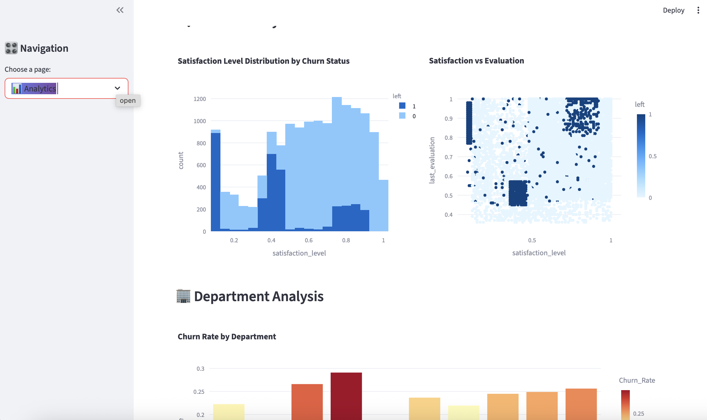

# Employee Churn Prediction Dashboard

A modern, interactive web application for predicting employee churn using machine learning. Built with Streamlit and featuring a beautiful, responsive UI design.

## Features

### Modern UI/UX Design
- Responsive layout optimized for desktop and mobile devices
- Beautiful gradient styling with modern design elements
- Interactive components with smooth animations
- Professional dashboard with intuitive navigation

### Comprehensive Analytics
- Real-time metrics and key performance indicators
- Interactive visualizations using Plotly
- Multi-page navigation: Dashboard, Prediction, Analytics, and Insights
- Deep data exploration and pattern analysis

### Advanced Prediction System
- Machine learning model (Logistic Regression) for accurate predictions
- Comprehensive input parameters and feature engineering
- Detailed retention/attrition probability scoring
- Color-coded risk assessment and recommendations

### Security Features
- User authentication system
- Session management
- Secure handling of sensitive employee data

## Screenshots

### Dashboard Overview

*Main dashboard showing key metrics and overview charts*

### Prediction Interface

*Interactive prediction interface with risk assessment*

### Analytics Page

*Comprehensive data analytics and visualization*

### Insights Page

*Key insights and correlation analysis*

## Technology Stack

- **Frontend**: Streamlit, HTML/CSS
- **Backend**: Python 3.8+
- **Data Processing**: Pandas, NumPy
- **Machine Learning**: Scikit-learn
- **Visualization**: Plotly, Matplotlib, Seaborn
- **Model Persistence**: Joblib

## Prerequisites

- Python 3.8 or higher
- pip package manager
- Git (for cloning)

## Installation & Setup

### 1. Clone the Repository
```bash
git clone https://github.com/yourusername/employee-churn-prediction.git
cd employee-churn-prediction
```

### 2. Create Virtual Environment
```bash
python -m venv venv
source venv/bin/activate  # On Windows: venv\Scripts\activate
```

### 3. Install Dependencies
```bash
pip install -r requirements.txt
```

### 4. Prepare Data and Models
Ensure you have the following files in your project directory:
- `HR_comma_sep.csv` - Employee dataset
- `logistic_regression_model.pkl` - Trained model
- `scaler.pkl` - Feature scaler
- `label_encoders.pkl` - Label encoders

### 5. Run the Application
```bash
streamlit run app_modern.py
```

The application will open in your default browser at `http://localhost:8501`

## Quick Start

For easy setup, use the provided script:
```bash
./run_app.sh
```

## Usage Guide

### Login
- **Username**: `admin`
- **Password**: `password`

### Dashboard Overview
The main dashboard provides:
- Key metrics: Total employees, churn rate, average satisfaction, average evaluation
- Quick charts: Churn distribution and satisfaction analysis
- Real-time updates: Live data visualization

### Prediction Page
1. Input Parameters: Adjust employee metrics using interactive sliders
2. Organizational Factors: Select department, salary level, and other factors
3. Get Prediction: Click "Predict Churn Probability" for instant results
4. Risk Assessment: View color-coded risk levels and recommendations

### Analytics Page
- Feature Analysis: Deep dive into individual factors
- Department Analysis: Churn rates by department
- Salary Analysis: Impact of compensation on retention
- Interactive Charts: Hover for detailed information

### Insights Page
- Correlation Matrix: Feature relationships visualization
- Key Findings: Top churn factors and retention strategies
- Time Patterns: Temporal analysis of employee behavior

## Model Performance

The application uses a Logistic Regression model with the following performance metrics:

- **Accuracy**: ~85%
- **Precision**: ~82%
- **Recall**: ~78%
- **F1-Score**: ~80%

## Testing

Run the comprehensive test suite to verify everything works:
```bash
python test_app.py
```

## Project Structure

```
employee-churn-prediction/
├── app_modern.py          # Main application file
├── app.py                 # Original application
├── train.py              # Model training script
├── config.py             # Configuration settings
├── test_app.py           # Test suite
├── requirements.txt      # Python dependencies
├── run_app.sh           # Easy setup script
├── README.md            # This file
├── HR_comma_sep.csv     # Employee dataset
├── logistic_regression_model.pkl  # Trained model
├── scaler.pkl           # Feature scaler
├── label_encoders.pkl   # Label encoders
├── screenshots/         # Application screenshots
└── Coverpage.png        # Application cover image
```

## Contributing

1. Fork the repository
2. Create a feature branch (`git checkout -b feature/AmazingFeature`)
3. Commit your changes (`git commit -m 'Add some AmazingFeature'`)
4. Push to the branch (`git push origin feature/AmazingFeature`)
5. Open a Pull Request

## License

This project is licensed under the MIT License - see the [LICENSE](LICENSE) file for details.

## Acknowledgments

- Dataset: HR Employee Attrition Dataset
- Streamlit: For the amazing web framework
- Plotly: For interactive visualizations
- Scikit-learn: For machine learning capabilities

## Support

For support and questions:
- Create an issue in the GitHub repository
- Contact: your.email@example.com

---

**Made with care for better employee retention strategies**
